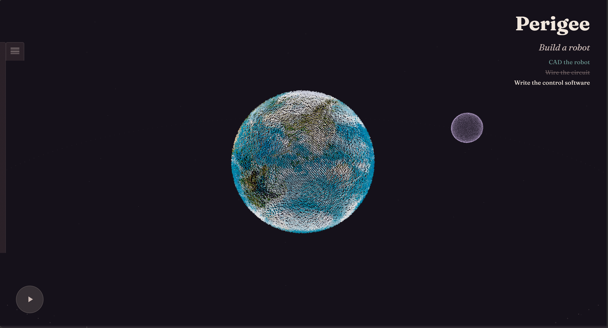
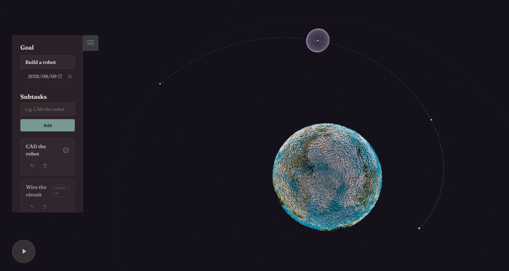
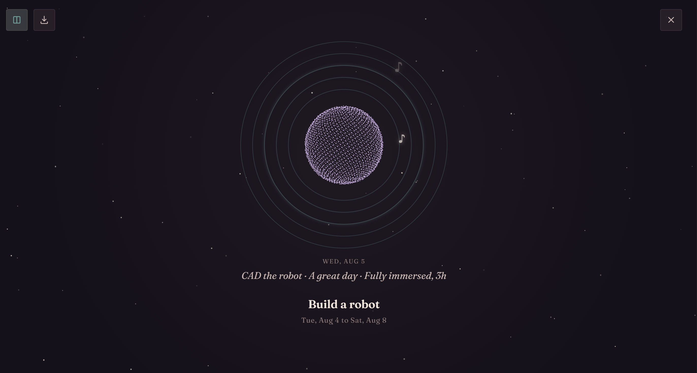

# Perigee

Turn your daily progress on a goal into a song!

_Perigee is he closest point to Earth in the orbit of the Moon or an artificial satellite_

## The idea

Our quote is "The smallest moon can change the path of a giant."

Which made us associate with daily situations when small things make big changes. For examples:

1. The accumulation of small daily achievements eventually help people reach big goals.
2. A single note in a song can change the trajectory of the entire song.

With these two inspirations, we came up with the idea of this website where your daily progress is recorded in term of ntoes and eventually a piece of music is generated to represent the process.

## ScreenShots & Video

## How it works

1. Click the bookmark sign on the left side, write down the goal
2. Split the goal into subtasks
3. Log a day (effort + mood) against a subtask
4. Mark a subtask complete / given up
5. Play the song and see the daily records
6. download and view the sheet music if needed

### Logic

<!-- What state does the app track, and where does it live? -->

### Music

_Simple quadruple meter_

1. We used six out of the seven church modes.(ex. Phrygain: darkest -> Lydian: brightest)
2. Each substack froms a movement, each movement is in a specific mode (depends on the average score of mood in that subtask)
3. effort -> rhythm (ex. barely -> one short note/bar; immersed -> four notes/bar)
4. mood -> pitch (ex. happier -> higher pitch)

## Tech stack

- HTML / CSS / JavaScript (vanilla, no framework, no build step)
- [Three.js](https://threejs.org/): made the 3D model for the moon-earth scene and the bird-sight view
- Web Audio API: played the JavaScript coded music
- [Google Fonts](https://fonts.google.com/) (Fraunces)

## Getting started

1. Clone the repo
2. Open `index.html` with a local server (e.g. VS Code Live Server)
3. Click the "demo" button at the button of the page, or add your own subtasks

## File structure

- `index.html`: the structure of the wensite, the scene for the 3D plants, the music box and the orbit page
- `script.js`: controls how mood and effort are transferred into music, how to play the music, how to store the subtask information
- `orbit-scene.js`: built the 3d plants, the bird-sight view
- `styles.css`: style everything
- `three.module.js`
- `assets/`: pictures and video
- `music_test/`: round one music generation
